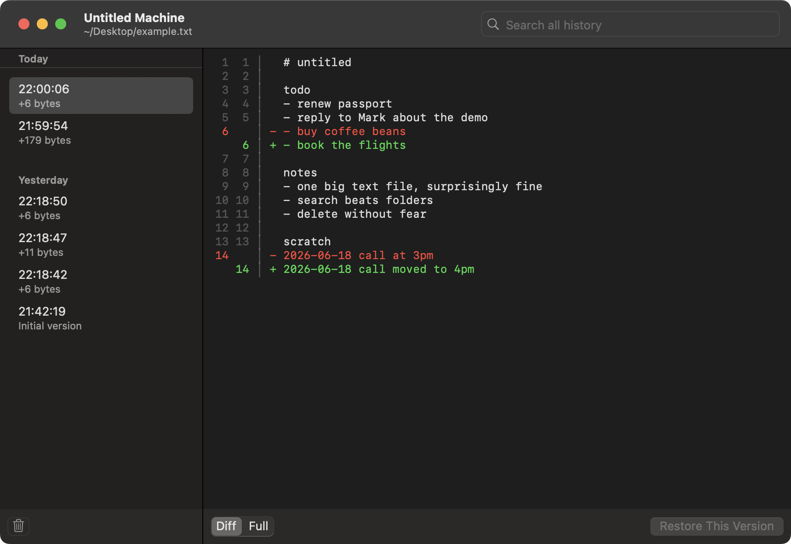

# Untitled Machine

A version-history companion for your One Big Text File (OBTF).
Not an editor — bring your own.

It watches one text file — that ever-growing `Untitled.txt` you pour everything into — and saves a snapshot whenever it changes, so you can browse, diff, search, and restore any past version. The goal isn't to never lose anything; it's to let you delete freely, knowing you can get it back.

## How it works

- Pick one text file to watch.
- Each save becomes a snapshot (rapid saves are debounced into one).
- Versions are listed by day; select one to see its diff or full text.
- Search covers the whole history (substring, works with Japanese too).
- Restore writes a past version back to the file.

It runs in the menu bar. Open the history window from the menu bar icon; close it and watching continues. It can launch at login.

## Notes

- Targets UTF-8 text files. Non-UTF-8 files are skipped, not corrupted.
- History is stored unencrypted in a local SQLite database under `~/Library/Application Support/UntitledMachine/`. 
- To purge sensitive text: search for it, select all, delete.

## Requirements

macOS 13+.

## Build

Open `UntitledMachine.xcodeproj` in Xcode and run.

## License

Apache-2.0

## Author

@tnantoka

